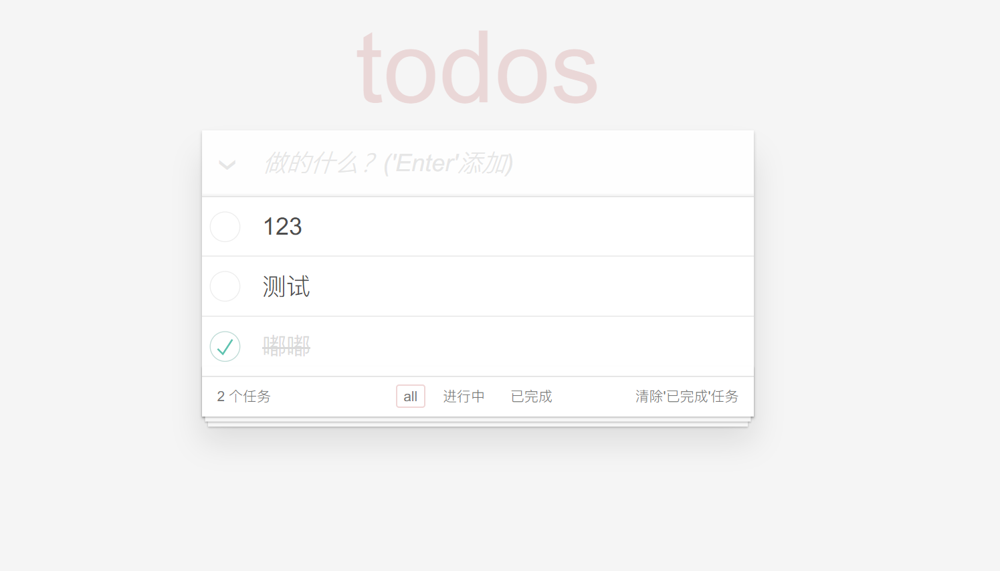

## todo_vue

`<script>`标签引入、全局组件方式开发的todo程序。

目的：熟悉**MVVM**的开发方式，及Vue基础语法。

## 使用

`npm i`安装依赖

## 功能

功能需求按照[todoMVC](https://github.com/tastejs/todomvc/blob/master/app-spec.md#functionality)要求开发

## 截图

